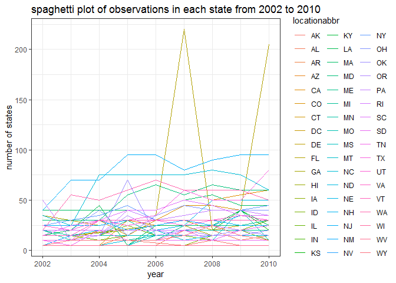
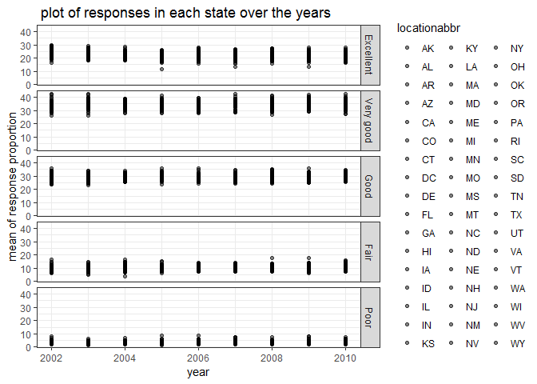

p8105\_hw3\_cy2522
================
Chu YU
2018-Oct-6

problem 1
=========

``` r
## import the data
library(p8105.datasets)
library(tidyverse)
```

    ## -- Attaching packages -------------------------------------------------------- tidyverse 1.2.1 --

    ## √ ggplot2 3.0.0     √ purrr   0.2.5
    ## √ tibble  1.4.2     √ dplyr   0.7.6
    ## √ tidyr   0.8.1     √ stringr 1.3.1
    ## √ readr   1.1.1     √ forcats 0.3.0

    ## -- Conflicts ----------------------------------------------------------- tidyverse_conflicts() --
    ## x dplyr::filter() masks stats::filter()
    ## x dplyr::lag()    masks stats::lag()

``` r
theme_set(theme_bw() + theme(legend.position = "right"))
data(brfss_smart2010)

## do some data cleaning
brfss_tidy = brfss_smart2010 %>% 
  janitor::clean_names() %>%
  filter(topic == "Overall Health") %>%
  mutate(response = 
           factor(response, order = TRUE, levels = c("Excellent", "Very good", "Good", "Fair","Poor"))) 
```

the questions in problem 1
--------------------------

``` r
# answer the questions

## which state is observed at 7 locations:
filter(brfss_tidy, year == "2002") %>% 
  group_by(locationabbr) %>%
  summarize(n_location = n_distinct(locationdesc)) %>%
  filter(n_location == 7)
```

    ## # A tibble: 3 x 2
    ##   locationabbr n_location
    ##   <chr>             <int>
    ## 1 CT                    7
    ## 2 FL                    7
    ## 3 NC                    7

``` r
## number of observations in each state in different years
brfss_tidy %>% 
  group_by(year, locationabbr) %>%
  summarize(n_state = n()) %>%
  ggplot(aes(x = year, y = n_state, color = locationabbr)) +
  geom_line() +
  labs( 
    title = "spaghetti plot of observations in each state from 2002 to 2010",
    x = "year",
    y = "number of states")
```



``` r
## table for NY state
NY_table = filter(brfss_tidy , 
                  response == "Excellent" &locationabbr == "NY" & (year == "2002" | year == "2006"| year == "2010")) %>%
  group_by(year) %>%
  summarize(mean(data_value), sd(data_value)) %>%
  knitr::kable(digits = 3, col.names = c("year", "mean", "sd"), caption = "the form of Excellent response data in NY") 

NY_table
```

|  year|    mean|     sd|
|-----:|-------:|------:|
|  2002|  24.040|  4.486|
|  2006|  22.533|  4.001|
|  2010|  22.700|  3.567|

``` r
## panel plots
brfss_tidy %>% 
  group_by(year, response, locationabbr) %>%
  summarize(mean = mean(data_value)) %>%
  ggplot(aes(x = year, y = mean, fill = locationabbr))+
           geom_point(alpha = .5) +
           facet_grid(response ~ .) +
            labs( 
    title = " plot of responses in each state over the years",
    x = "year",
    y = "mean of response proportion")
```

    ## Warning: Removed 21 rows containing missing values (geom_point).

 Problem 1 answers: 1. cleaning the dataset: - clean the names of the variables of the brfss data. - `filter` the topic so that there is only one topic "Overall Health" - use `mutate` function so that I can set the order of the factor response, from which I can also see delete the other seponses in the dataset.

1.  questions:
    -   In 2002, **CT, FL, NC** were observed at 7 locations. (After `group_by` and `summarize` we can get the number of observations of each state, then we can get the three states whose observations equal 7.)
    -   We can see the plot named "spaghetti plot of observations in each state from 2002 to 2010" above. From the plot we can know that overall the states' observations are increasing. And we can also see the different tendency of observations of each state and the differences between them.
    -   From the table shown above, from 2002 to 2010, the average of Excellent proportion in NY has been increasing, meanwhile the sd is getting smaller, meaning that the response value data of Excellent is getting more stable.
    -
