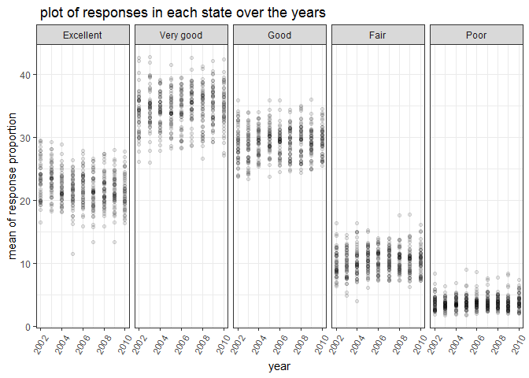

p8105\_hw3\_cy2522
================
Chu YU
2018-Oct-6

problem 1
=========

``` r
## import the data
library(p8105.datasets)
library(tidyverse)
```

    ## -- Attaching packages ------------------------------------- tidyverse 1.2.1 --

    ## √ ggplot2 3.0.0     √ purrr   0.2.5
    ## √ tibble  1.4.2     √ dplyr   0.7.6
    ## √ tidyr   0.8.1     √ stringr 1.3.1
    ## √ readr   1.1.1     √ forcats 0.3.0

    ## -- Conflicts ---------------------------------------- tidyverse_conflicts() --
    ## x dplyr::filter() masks stats::filter()
    ## x dplyr::lag()    masks stats::lag()

``` r
theme_set(theme_bw() + theme(legend.position = "right"))
data(brfss_smart2010)

## do some data cleaning
brfss_tidy = brfss_smart2010 %>% 
  janitor::clean_names() %>%
  filter(topic == "Overall Health") %>%
  mutate(response = 
           factor(response, order = TRUE, levels = c("Excellent", "Very good", "Good", "Fair","Poor"))) 
```

the questions in problem 1
--------------------------

``` r
# answer the questions

## which state is observed at 7 locations:
filter(brfss_tidy, year == "2002") %>% 
  group_by(locationabbr) %>%
  summarize(n_location = n_distinct(locationdesc)) %>%
  filter(n_location == 7)
```

    ## # A tibble: 3 x 2
    ##   locationabbr n_location
    ##   <chr>             <int>
    ## 1 CT                    7
    ## 2 FL                    7
    ## 3 NC                    7

``` r
## number of observations in each state in different years
brfss_tidy %>% 
  group_by(year, locationabbr) %>%
  summarize(n_state = n()) %>%
  ggplot(aes(x = year, y = n_state, color = locationabbr)) +
  geom_line() +
  labs( 
    title = "spaghetti plot of observations in each state from 2002 to 2010",
    x = "year",
    y = "number of states")
```


``` r
## table for NY state
NY_table = filter(brfss_tidy , 
                  response == "Excellent" &locationabbr == "NY" & (year == "2002" | year == "2006"| year == "2010")) %>%
  group_by(year) %>%
  summarize(mean(data_value), sd(data_value)) %>%
  knitr::kable(digits = 3, col.names = c("year", "mean", "sd"), caption = "the form of Excellent response data in NY") 

NY_table
```

|  year|    mean|     sd|
|-----:|-------:|------:|
|  2002|  24.040|  4.486|
|  2006|  22.533|  4.001|
|  2010|  22.700|  3.567|

``` r
## panel plots
brfss_tidy %>% 
  group_by(year, response, locationabbr) %>%
  summarize(mean = mean(data_value)) %>%
  ggplot(aes(x = year, y = mean, fill = locationabbr))+
           geom_point(alpha = .5) +
           facet_grid(response ~ .) +
            labs( 
    title = " plot of responses in each state over the years",
    x = "year",
    y = "mean of response proportion")
```

    ## Warning: Removed 21 rows containing missing values (geom_point).

 Problem 1 answers: **1. cleaning the dataset:** - clean the names of the variables of the brfss data. - `filter` the topic so that there is only one topic "Overall Health" - use `mutate` function so that I can set the order of the factor response, from which I can also see delete the other seponses in the dataset.

\*\* 2. questions:** - In 2002, **CT, FL, NC\*\* were observed at 7 locations. (After `group_by` and `summarize` we can get the number of observations of each state, then we can get the three states whose observations equal 7.) - We can see the plot named "spaghetti plot of observations in each state from 2002 to 2010" above. From the plot we can know that overall the states' observations are increasing. And we can also see the different tendency of observations of each state and the differences between them. - From the table shown above, from 2002 to 2010, the average of Excellent proportion in NY has been increasing, meanwhile the sd is getting smaller, meaning that the response value data of Excellent is getting more stable. -

problem 2
=========

``` r
## import the data
library(p8105.datasets)

data(instacart)

## exploration of the data
inst_tidy = instacart %>%
  janitor::clean_names()

 dim(inst_tidy)
```

    ## [1] 1384617      15

``` r
 str(inst_tidy)
```

    ## Classes 'tbl_df', 'tbl' and 'data.frame':    1384617 obs. of  15 variables:
    ##  $ order_id              : int  1 1 1 1 1 1 1 1 36 36 ...
    ##  $ product_id            : int  49302 11109 10246 49683 43633 13176 47209 22035 39612 19660 ...
    ##  $ add_to_cart_order     : int  1 2 3 4 5 6 7 8 1 2 ...
    ##  $ reordered             : int  1 1 0 0 1 0 0 1 0 1 ...
    ##  $ user_id               : int  112108 112108 112108 112108 112108 112108 112108 112108 79431 79431 ...
    ##  $ eval_set              : chr  "train" "train" "train" "train" ...
    ##  $ order_number          : int  4 4 4 4 4 4 4 4 23 23 ...
    ##  $ order_dow             : int  4 4 4 4 4 4 4 4 6 6 ...
    ##  $ order_hour_of_day     : int  10 10 10 10 10 10 10 10 18 18 ...
    ##  $ days_since_prior_order: int  9 9 9 9 9 9 9 9 30 30 ...
    ##  $ product_name          : chr  "Bulgarian Yogurt" "Organic 4% Milk Fat Whole Milk Cottage Cheese" "Organic Celery Hearts" "Cucumber Kirby" ...
    ##  $ aisle_id              : int  120 108 83 83 95 24 24 21 2 115 ...
    ##  $ department_id         : int  16 16 4 4 15 4 4 16 16 7 ...
    ##  $ aisle                 : chr  "yogurt" "other creams cheeses" "fresh vegetables" "fresh vegetables" ...
    ##  $ department            : chr  "dairy eggs" "dairy eggs" "produce" "produce" ...
    ##  - attr(*, "spec")=List of 2
    ##   ..$ cols   :List of 15
    ##   .. ..$ order_id              : list()
    ##   .. .. ..- attr(*, "class")= chr  "collector_integer" "collector"
    ##   .. ..$ product_id            : list()
    ##   .. .. ..- attr(*, "class")= chr  "collector_integer" "collector"
    ##   .. ..$ add_to_cart_order     : list()
    ##   .. .. ..- attr(*, "class")= chr  "collector_integer" "collector"
    ##   .. ..$ reordered             : list()
    ##   .. .. ..- attr(*, "class")= chr  "collector_integer" "collector"
    ##   .. ..$ user_id               : list()
    ##   .. .. ..- attr(*, "class")= chr  "collector_integer" "collector"
    ##   .. ..$ eval_set              : list()
    ##   .. .. ..- attr(*, "class")= chr  "collector_character" "collector"
    ##   .. ..$ order_number          : list()
    ##   .. .. ..- attr(*, "class")= chr  "collector_integer" "collector"
    ##   .. ..$ order_dow             : list()
    ##   .. .. ..- attr(*, "class")= chr  "collector_integer" "collector"
    ##   .. ..$ order_hour_of_day     : list()
    ##   .. .. ..- attr(*, "class")= chr  "collector_integer" "collector"
    ##   .. ..$ days_since_prior_order: list()
    ##   .. .. ..- attr(*, "class")= chr  "collector_integer" "collector"
    ##   .. ..$ product_name          : list()
    ##   .. .. ..- attr(*, "class")= chr  "collector_character" "collector"
    ##   .. ..$ aisle_id              : list()
    ##   .. .. ..- attr(*, "class")= chr  "collector_integer" "collector"
    ##   .. ..$ department_id         : list()
    ##   .. .. ..- attr(*, "class")= chr  "collector_integer" "collector"
    ##   .. ..$ aisle                 : list()
    ##   .. .. ..- attr(*, "class")= chr  "collector_character" "collector"
    ##   .. ..$ department            : list()
    ##   .. .. ..- attr(*, "class")= chr  "collector_character" "collector"
    ##   ..$ default: list()
    ##   .. ..- attr(*, "class")= chr  "collector_guess" "collector"
    ##   ..- attr(*, "class")= chr "col_spec"

``` r
 n_distinct(inst_tidy$product_id) 
```

    ## [1] 39123

problem 2 \*\* 1. Exploration of the datasets\*\* - From the datasets, we can see the size is 1384617, 15, meaning there are 1384614 observations of 15 variables. Using `str()` we can get the overall struction of the data. - The variables in the dataset are characters and integers. The variable order\_id , product\_id, user\_id , add\_to\_cart\_order and some other variables are all integers, and there are character variables like eval\_set, product\_name and aisle.
- We can know the meaning of some variables via the values and names of them -- the IDs of the products, users, departments and orders, the names of the products, the number of orders and so on. So from the data we can know that this may be the trading data from instacart. By using `n_distinct`, we can get the exact number of the orders and products and other things . For example, we can know there are 39123 products sold in the dataset.

**2. questions**

``` r
## How many aisles are there, and which aisles are the most items ordered from?

n_distinct(inst_tidy$aisle)
```

    ## [1] 134

``` r
names(table(inst_tidy$aisle))[which.max(table(inst_tidy$aisle))]
```

    ## [1] "fresh vegetables"

``` r
## Make a plot that shows the number of items ordered in each aisle. Order aisles sensibly, and organize your plot so others can read it.

inst_tidy %>%
  group_by(aisle, department) %>%
  summarize(n = n()) %>%
  ggplot(aes(x = aisle, y = n, color = department)) +
  ylim(0, 40000) +
  geom_point() +
  facet_grid(.~ department  ) +
  labs( 
    title = " plot of aisles data",
    x = "department",
    y = "number")
```

    ## Warning: Removed 5 rows containing missing values (geom_point).


``` r
## Make a table showing the most popular item aisles 

inst_tidy %>%
  filter(aisle %in% c("baking ingredients", "dog food care", "packaged vegetables fruits")) %>%
  group_by(aisle) %>%
  summarize(
    mostpop = names(table(product_name))[which.max(table(product_name))]) %>%
  knitr::kable(caption = "table of most popular items")
```

| aisle                      | mostpop                                       |
|:---------------------------|:----------------------------------------------|
| baking ingredients         | Light Brown Sugar                             |
| dog food care              | Snack Sticks Chicken & Rice Recipe Dog Treats |
| packaged vegetables fruits | Organic Baby Spinach                          |

``` r
## Make a table showing the mean hour of the day
 
inst_tidy %>% 
  filter(product_name %in% c("Pink Lady Apples", "Coffee Ice Cream")) %>%
  group_by(product_name, order_dow) %>%
  summarize(mean = mean(order_hour_of_day)) %>%
  spread(key = order_dow, value = mean) %>%
  knitr::kable(digits = 3, caption = "the table of mean hour")
```

| product\_name    |       0|       1|       2|       3|       4|       5|       6|
|:-----------------|-------:|-------:|-------:|-------:|-------:|-------:|-------:|
| Coffee Ice Cream |  13.774|  14.316|  15.381|  15.318|  15.217|  12.263|  13.833|
| Pink Lady Apples |  13.441|  11.360|  11.702|  14.250|  11.552|  12.784|  11.938|

problem 2 **2. questions:** (1) How many aisles are there, and which aisles are the most items ordered from? - There are 134 distinct aisles, and most items ordered from "fresh vegetables".

1.  Make a plot that shows the number of items ordered in each aisle.

-   From the plot above, we can see the different number of products ordered in each aisle. Histogram can clearly present the differences between the amounts of each variable. And to be clearer, I use colors depend on the department. But the plot still need to be seen from a bigger window due to the large number of aisles.

1.  Make a table showing the most popular item from certain aisles.

-   The 3\*2 table has two variables -- "aisle" and "mostpop". From the table, we can know that:
-   In "baking ingredients" aisle, "Light Brown Sugar" is the most popular;
-   In "dog food care", "Snacks sticks Chicken & Rice Recipe Dog Treats" is the most popular;
-   In "packages vegetables fruits", "Organic Baby Spinach" is the most popular.

1.  Make a table showing the mean hour of the day.

-   I finally get a 2\*7 table. There are 7 key variables as column names -- from 0 to 6, and the row names are the names of the two products. The values are means of the hours of each day in a week.
